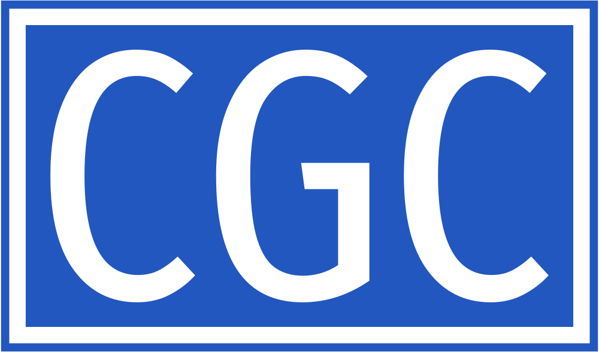
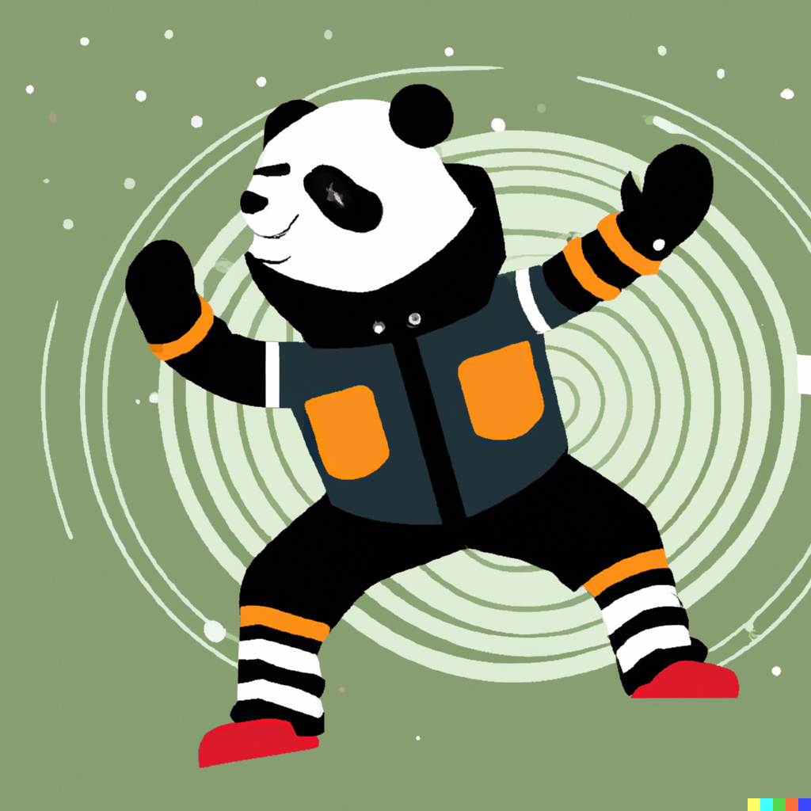
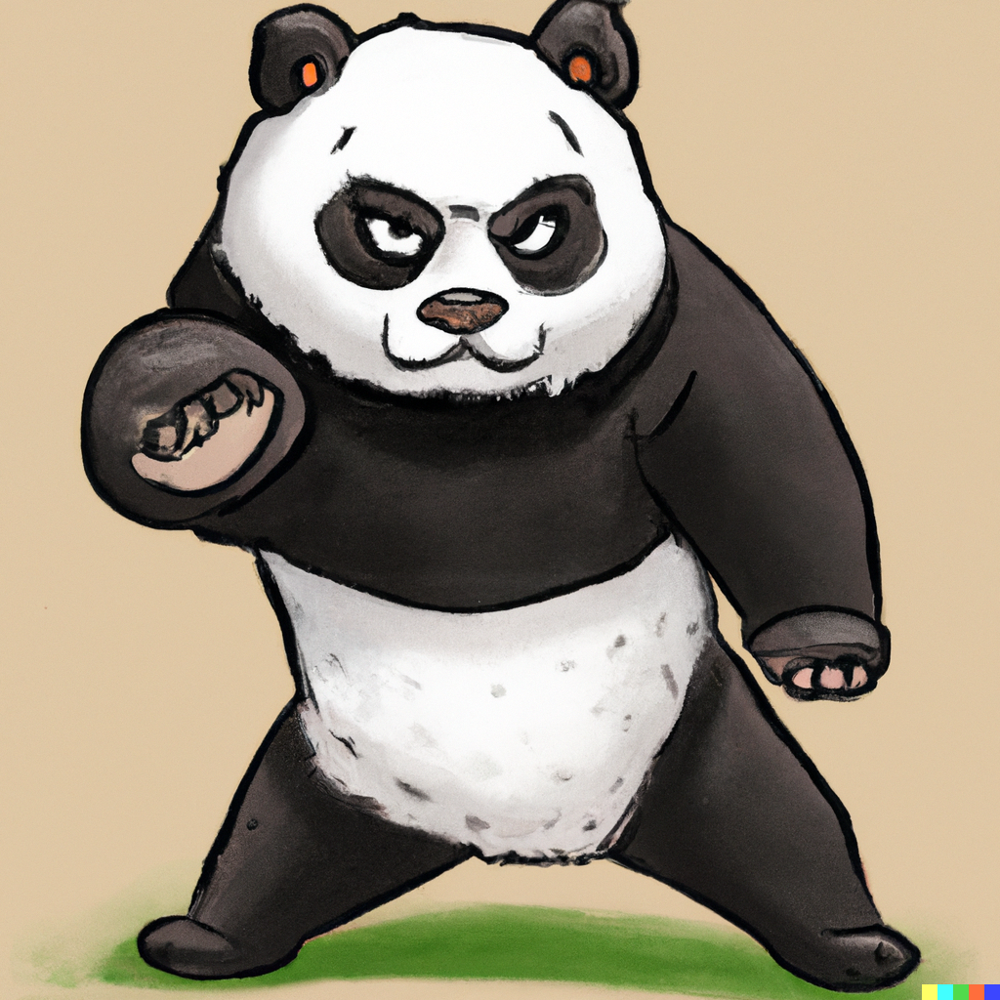

    
    

        
        
        
        
        
    

    

        你好，我们是ChatGPT代号DALL.E.2创造出来的胖嘚(PANDA)家族。我们这次的任务是守护社区
    

    

        你可以称呼我们为 熊大、噢耶、锅盖、胖帅、不服老幺
    

    
    
    

如果不了解什么是ChatGPT, 可以访问ChatGPT官网了解更多信息，以下是相关资源链接
- [ChatGPT共创社区网站](https://chatgpt-community.cn/)
- [ChatGPT官网](https://platform.openai.com/) 
- [ChatGPT论坛](https://community.openai.com/)
- [ChatGPT案例](https://platform.openai.com/examples)
- [ChatGPT文档](https://platform.openai.com/docs/introduction/)

## 在这儿可以做什么
- 提供学习ChatGPT的相关资源和资料 
- 分享有趣有价值的博客，与他人交流 
- 参与共创研讨会、让你在思想碰撞当中寻求灵感 
- 寻找到志同道合的朋友甚至是合作伙伴 
- 赋能产品和技术解决方案、完成技术团队搭建 
- 开展项目工作坊、赋能项目落地 
- 项目路演，让你这匹千里马遇上真正的伯乐！

### 如何能够成为会员
你需要遵守1-2-1原则，完成如下的任务才能够申请成为社区的正式成员，这样做的目标是能够确保社区能够处于一个积极沟通、氛围良好的状态。
- 参加一次线上或线下活动，准备2分-5钟的自我介绍，和社区成员相互认识。
- 结合活动提出反馈和建议，对于ChatGPT的理解做一次分享或者完成一篇博客
- 与社区运营负责人或者推荐人达成共识，参加活动并分享

### 微信加好友了解更多细节

### 招贤令，项目合作
1.  如果你期望能够能深度的体验和了解ChatGPT
2.  如果你期望能够认识更多的朋友
3.  如果你期望能够更多的链接资源
4.  同时我们希望你能够有时间投入、乐于支持和鼓励他人、并协助社区开展相关活动
> 赶紧扫上面的微信深入交流，加入运营团队把，名额有限，先到先得！

### 联系方式

chatgpt_community@163.com

### 社区捐赠

感谢对社区的支持、您的捐赠将帮助我们不断完善社区内容，更好的服务，并吸引更多的使用者。谢谢您的支持！

 

