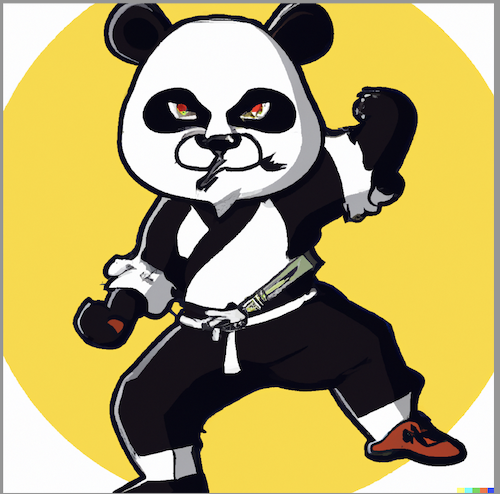

    

        
        
        
        
        
    

    

        你好，我们是ChatGPT代号DALL.E.2创造出来的胖嘚(PANDA)家族。我们这次的任务是守护社区 
        你可以称呼我们为 熊大、噢耶、锅盖、胖帅、不服老幺
    

如果不了解什么是ChatGPT, 可以访问ChatGPT官网了解更多信息，以下是相关资源链接
- [ChatGPT共创社区网站](https://chatgpt-community.cn/)
- [ChatGPT官网](https://platform.openai.com/) 
- [ChatGPT论坛](https://community.openai.com/)
- [ChatGPT案例](https://platform.openai.com/examples)
- [ChatGPT文档](https://platform.openai.com/docs/introduction/)

## 在这儿可以做什么
- 提供学习ChatGPT的相关资源和资料 
- 分享有趣有价值的博客，与他人交流 
- 参与共创研讨会、让你在思想碰撞当中寻求灵感 
- 寻找到志同道合的朋友甚至是合作伙伴 
- 赋能产品和技术解决方案、完成技术团队搭建 
- 开展项目工作坊、赋能项目落地 
- 项目路演，让你这匹千里马遇上真正的伯乐！

### 微信加好友了解更多细节

